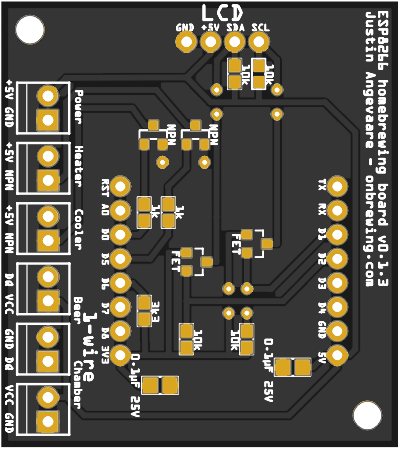
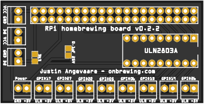

<h2>About me</h2>

I am a PhD candidate in the Department of Mathematics and Statistics at the University of Guelph. I am advised by <a href="https://zfeng.uoguelph.ca">Prof. Zeny Feng</a> and <a href="http://people.ucalgary.ca/~robert.deardon/">Prof. Rob Deardon</a>.

In my research I navigate the computational challenges in the statistical modelling of complex population processes. Applications in population ecology such as wildlife management and the dynamics of infectious diseases are of particular interest to me. This involves me in the study of topics in Bayesian inference, computational statistics, and data visualization. Much of my recent work has been implemented in open-source software packages.

Current software projects

<i>Pathogen.jl (2015-present)</i>

<a href="https://github.com/jangevaare/Pathogen.jl">Pathogen.jl</a> is an implementation of some of my PhD research into transmission network individual level models of infectious disease, and <a href="https://en.wikipedia.org/wiki/Viral_phylodynamics">phylodynamic</a> models in <a href="https://julialang.org">Julia</a>. It seeks to provide accessible and flexible tools for the simulation, description, visualization, and Bayesian inference of such models. This software provides methods for imputation of event times and transmission networks using data augmentation 

<i>SubstitutionModels.jl (2017-present)</i>

<a href="https://github.com/BioJulia/SubstitutionModels.jl">SubstitutionModels.jl</a> is a package that I&#39;ve contributed to the <a href="https://biojulia.net/Bio.jl/">BioJulia organization</a>. At this time, it provides performant utilities for dealing with nucleic acid substitution models using <a href="https://github.com/JuliaArrays/StaticArrays.jl">StaticArrays.jl</a> and Julia&#39;s <a href="https://docs.julialang.org/en/v1/manual/methods/">multiple dispatch</a>. These models are used for genetic distance calculations, phylogenetic tree construction, genetic sequence simulation, etc.

<i>PhyloTrees.jl (2016-present)</i>

<a href="https://github.com/jangevaare/PhyloTrees.jl">PhyloTrees.jl</a> provides a representation of rooted phylogenetic trees in Julia. My eventual goal is to implement Bayesian phylogenetic tree inference using MCMC in Julia, using this package. For the time being it has been used in the implementation of phylodynamic models as part of my PhD research.

<i>GeneticBitArrays.jl (2019-present)</i>

<a href="https://github.com/jangevaare/GeneticBitArrays.jl">GeneticBitArrays.jl</a> uses <a href="https://docs.julialang.org/en/v1/base/arrays/#Base.BitArray">Julia&#39;s <code>BitArray</code>s</a> to represent RNA and DNA sequences. This representation is space efficient and highly interpretable. Also, promotion in Julia makes for succinct usage of <code>GeneticBitArrays</code> with linear algebra - such as may be used for phylogenetic inference, and simulation of genetic sequences.

<i>PhyloModels.jl (2016-2020)</i>

<a href="https://github.com/jangevaare/PhyloModels.jl">PhyloModels.jl</a> builds on my work with <a href="https://github.com/jangevaare/GeneticBitArrays.jl">GeneticBitArrays.jl</a>, <a href="https://github.com/jangevaare/PhyloTrees.jl">PhyloTrees.jl</a>, <a href="https://github.com/BioJulia/SubstitutionModels.jl">SubstitutionModels.jl</a>. It implements <a href="https://doi.org/10.1093%2Fsysbio%2F22.3.240">Felsenstein&#39;s Pruning Algorithm</a> for loglikelihood calculation of phylogenetic trees with aligned genetic sequences at their tips. A <code>Dict</code> with <code>Int64</code> node IDs as keys and <code>GeneticSeq</code> as values is used for input for the loglikelihood calculation, as well as the output from simulation of genetic sequences.

Articles

<i>Preprints</i>
<ul>
<li><b>Angevaare, J.</b>, Feng, Z. and Deardon, R. (2020) Infectious disease transmission network modelling with the Julia language. arXiv:<a href="https://arxiv.org/abs/2002.05850">2002.05850</a></li>
</ul>

<i>Submitted</i>
<ul>
<li><b>Angevaare, J.</b>, Feng, Z. and Deardon, R. (2020) Infectious disease transmission network modelling with the Julia language. Submitted to the Journal of Statistical Software</li>
<li><b>Angevaare, J.</b>, Feng, Z. and Deardon, R. (2020) Inference of latent event times and transmission networks in individual level infectious disease models. Submitted to Spatial and Spatiotemporal Epidemiology</li>
</ul>

Proceedings

<ul><li>Rose, D., Edwards, B., Kett, R., Gillis, D., and <b>Angevaare, J.</b> (2017) Exploring Anthropogenic Activities and Management Decisions Using a Novel Environmental Agent Based Model. IEEE International Humanitarian Technology Conference, Toronto, ON
</li></ul>

Presentations

<ul>
<li><b>Angevaare, J.✦</b>, Feng, Z., Deardon, R. (2017) Simulation and inference of phylodynamic individual level models. Epidemics 6 International Conference on Infectious Disease Dynamics. Sitges, Spain (contributed oral presentation)</li>
<li><b>Angevaare, J.✦</b>, Feng, Z., Deardon, R. (2016) Phylodynamic individual level models: strategies for simulation and inference. Southwestern Ontario Graduate Mathematics and Statistics Conference, Guelph, ON (contributed poster presentation)</li>
<li><b>Angevaare, J.✦</b>, Feng, Z., Deardon, R. (2016) Phylodynamic individual level models: strategies for simulation and inference. Joint Statistical Meetings, Chicago, IL (contributed poster presentation)</li>
<li><b>Angevaare, J.✦</b>, Feng, Z., Deardon, R. (2016) Phylodynamic individual level models: strategies for simulation and inference. Annual Meeting of the Statistical Society of Canada, Brock University, St. Catharines, ON (contributed poster presentation)</li>
<li><b>Angevaare, J.✦</b>, Feng, Z., Deardon, R. (2016) A Phylodynamic extension to individual level models. Canadian Association of Veterinary Epidemiology and Preventive Medicine Conference, University of Guelph, Guelph, ON (contributed poster presentation)</li>
<li>Rose, D.✦, Kett, R., Yodzis, M., <b>Angevaare, J.</b>, Gillis, D. (2015) A combined agent and stage structured model to investigate anthropogenic activities on a wild fish population. College of Physical and Engineering Science Undergraduate Poster Session, University of Guelph, Guelph, ON (contributed poster presentation)</li>
<li><b>Angevaare, J.✦</b> (2014) Fitting disease models with likelihoods. Community of Interest in Disease Modelling, University of Guelph, Guelph, ON (oral presentation)</li>
<li><b>Angevaare, J.✦</b>, Gillis, D., Darlington, G. (2014) Efficient Bayesian Inference for Conditionally Autoregressive Models. Annual Meeting of the Statistical Society of Canada, University of Toronto, Toronto, ON (contributed poster presentation)</li>
<li><b>Angevaare, J.✦</b>, Gillis, D. (2012). The Utility of Catch Per Unit Effort Variance. Annual Meeting of the Statistical Society of Canada, University of Guelph, Guelph, ON (contributed poster presentation)</li>
<li>Gillis, D.✦, <b>Angevaare, J.</b> (2012). Something’s Fishy. Colloquium Joint BIOM&amp;S Seminar Series, University of Guelph, Guelph, ON (invited presentation)</li></ul>
✦<small>presenting author</small>

Theses

<ul>
<li><b>Angevaare, J.</b> (2014) Efficient Bayesian Inference for Conditionally Autoregressive Models. Department of Mathematics and Statistics, University of Guelph, Guelph, ON. Master's Thesis. April 2014. 122 pp. Advisors: <a href="https://danielgillis.wordpress.com">Prof. Daniel Gillis</a>, <a href="https://mathstat.uoguelph.ca/people/darlington">Prof. Gerarda Darlington</a>.
</li></ul>

Technical documents

<ul>
<li>Gillis, D., Alexander, C., <b>Angevaare, J.</b>, Bakar, C., Cox, R., Kramski, N., Krsic, N. (2014) SON-BP Collaborative Lake Whitefish Research Project: Year 3 report. Technical document.</li>

<li><b>Angevaare, J.</b>, Gillis, D., Cox, R. (2014) SON-BP Collaborative Lake Whitefish Research Project: Milestone 5: Report on Application and Evaluation of Population Models. Technical document. June 2014. 28 pp.</li>

<li><b>Angevaare, J.</b>, Gillis, D. (2014) SON-BP Collaborative Lake Whitefish Research Project: Milestones C3 &amp; C4 - Estimates of Life History and Mortality Parameters of Lake Whitefish (Coregonus clupeaformis). Technical document. January 2014. 15 pp.</li>

<li>Gillis, D., <b>Angevaare, J.</b>, Rueffer, M., Horrocks, J. (2012). Analysis of Total Allowable Catch. Technical document. October 2012. 34 pp.</li>

<li><b>Angevaare, J.</b> (2012) Lake Huron Lake Whitefish Life History Parameters. Technical document. September 2012. 106 pp. (including appendices)</li>
</ul>

Previous software projects

<i>FishABM.jl (2014-2015)</i>

<a href="https://github.com/jangevaare/FishABM.jl">FishABM.jl</a> is an implementation of a lifecycle model that has applications for fisheries management. An age-structured model is used for adults, with options for commercial or recreational harvest. A highly detailed agent based model are used from egg through to juvenilles life stages, grouping individuals from the same brood into an single agent. Movement and various sources of mortality (habitat specific), and the eventual impact on assumptions surrounding movement and mortality on the health of the fishery can be tracked.

<i>Fisheries_ABM (2014)</i>

<a href="https://github.com/jangevaare/Fisheries_ABM">Fisheries_ABM</a> is a prototype for what would eventually be <a href="https://github.com/jangevaare/FishABM.jl">FishABM.jl</a>, built in R. It was an stochastic agent based model of a fishery which could account for harvest and anthropogenic mortality sources.

<i>ILMs.jl (2014-2015)</i>

<a href="https://github.com/jangevaare/ILMs.jl">ILMs.jl</a> was my first implementation of individual level models of infectious disease in Julia. It offers simulation and inference in continuous and discrete time, when event times can be assumed to be known, for models utilizing power-law infectivity kernel. This package is superceded by my more recent and involved work with <a href="https://github.com/jangevaare/Pathogen.jl">Pathogen.jl</a>. My experience developing this package convinced me to go all-in with Julia for my PhD research.

<i>ILMPythonTools (2014)</i>

<a href="https://github.com/jangevaare/ilmpythontools">ILMPythonTools</a> was an early python implementation of tools for individual level models of infectious disease. This work was stopped in favour of developing such tools instead in <a href="https://julialang.org">Julia</a>.

Just for fun

<i>brew2 (2018-present)</i>

<a href="https://github.com/jangevaare/brew2">brew2</a> is an app built in <a href="https://nodered.org">Node-RED</a> for brewery control using <a href="https://www.raspberrypi.org">Raspberry Pi</a>. It implements sophisticated PID algorithms for mash temperature control using various recirculating mash systems. Its more custom features are written in javascript. Logging uses <a href="https://www.influxdata.com">influxdb</a> time series database. I have a couple posts on my brewing blog related to this work <a href="https://onbrewing.com/brewing-with-node-red-pt-1/">here</a>, and <a href="https://onbrewing.com/brewing-with-node-red-pt-2-my-dashboard/">here</a>.
 

<i>Various CraftBeerPi3 plugins (2017-2019)</i>

I have developed several popular plugins for <a href="http://web.craftbeerpi.com">CraftBeerPi3</a> brewery control software in python:
<ul><li><a href="https://github.com/jangevaare/cbpi-CascadeControl">CascadeControl</a></li>
<li><a href="https://github.com/jangevaare/cbpi-DependentActor">DependentActor</a></li>
<li><a href="https://github.com/jangevaare/cbpi-OneWireAdvanced">OneWireAdvanced</a></li>
<li><a href="https://github.com/jangevaare/cbpi-OnAtStartup">OnAtStartup</a></li></ul>

I have a summary of these on my <a href="https://onbrewing.com/craftbeerpi-3-plugins/">brewing blog</a>.
<i>HopScrape (2018)</i>

<a href="https://github.com/jangevaare/HopScrape">This project</a> incorporated scraping, and imputation of hop data using <a href="https://www.crummy.com/software/BeautifulSoup/">BeautifulSoup</a>, <a href="https://pandas.pydata.org">pandas</a>, and <a href="https://pypi.org/project/fancyimpute/">fancyimpute</a>. The cleaned and imputed data resulting from this project are available on the repo.

<i>TriangleDash (2018)</i>

<a href="https://github.com/jangevaare/triangledash">TriangleDash</a> is a small application I made to learn <a href="https://plotly.com/dash/">Plotly&#39;s Dash</a>. It is an explanation, calculation, and visualization of results from triangle test sensory analysis. It&#39;s deployed on heroku and can be used <a href="https://triangledash.herokuapp.com">here</a>.

<i>Homebrewing PCBs (2018-Current)</i>

I learned a bit about PCB design and electronics, then created a couple board designs for homebrewing applications using Raspberry Pi and ESP8266 IoT devices <a href="https://github.com/jangevaare/Homebrewing-PCBs">and open-sourced them</a>. They can also be purchased from PCBS.io<a href="https://PCBs.io/share/4QvpO">1</a>, <a href="https://PCBs.io/share/zk7Px">2</a> and PCBWay.com<a href="https://www.pcbway.com/project/shareproject/ESP8266_Homebrew_v0_1_3.html">1</a>, <a href="https://www.pcbway.com/project/shareproject/Raspberry_Pi_Homebrew_board_v0_2_2.html">2</a>. 100s of these boards have now been produced.
 

